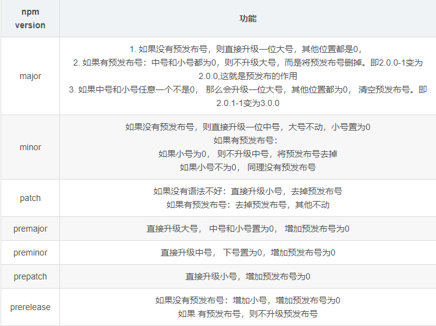

# package_one

## fs文件系统模块
    fs.readFile()文件读取
    
    fs.writeFile()文件写入 可以创建文件但是不能创建目录 多次使用方法写入一个文件，后写入的会覆盖先写入的

    _ _dirname表示当前文件所属目录

## path模块

    path.join()可以将字符串拼成一个完整的路径

    ../会抵消前面的路径,可以获取上个目录路径的文件

    文件的路径最好不要用+来进行拼接

    使用path.join(__dirname, '文件路径')

    path.basename(path,ext)获取路径中的最后一部分，通常使用这个方法获取文件名

    path <string> 必选参数，表示一个路径的字符串

    ext <string> 可选参数，表示文件扩展名

    如果不适用ext会返回连带着扩展名的文件名，如果使用ext那么不会返回扩展名,前提是ext参数和所获取的文件扩展名后缀一致

    path.extname(path)可以获取路径中扩展名部分

## 小实验拆解html文件 （package_two项目）

    index.js nodejs执行文件

    index.html 拆解前html文件

    main.css 拆解后css文件

    main.js 拆解后js文件

    main.html 拆解后html文件

## http模块
    在网络节点中，负责消费资源的电脑叫做客户端，负责对外提供网络资源的电脑叫做服务器

## ip地址

    ip地址相当于互联网上每台电脑的唯一标识,只有在知道对方ip地址的情况下，才能与对应的电脑进行数据通信

    ip地址的格式通常用点分十进制表示成(a.b.c.d)的形式，其中a,b,c,d都是在0~255之间的十进制整数

## 域名
    ip地址的别名

    域名与ip是一一对应的关系，这种对应关系存放在域名服务器中(DNS，Domain name server),使用者只需记好域名访问对应的服务器即可，对应的转换工作由DNS实现

## 端口号

    端口号是电脑中web服务的唯一标识，通过端口号可以准确的将请求交给对应的web服务来处理

    每个端口号同时只能被一个web服务使用

    在url中8080端口可以被省略，其他的不可以

## 创建web服务的基本步骤

    1、导入http模块

    2、创建web服务器实例 http.createServer()

    3、为服务器实例绑定request时间，监听客户端请求 server.on('request' , (req,res) => {})

        1）req请求对象

            req中包含了与客户端有关的数据和属性 如：req.url 客户端请求的URL地址、req.method 客户端的method请求方法

        2）res响应对象

            在服务器的request事件处理函数中，如果想访问与服务器有关的数据与属性，可以使用res 如res.end() 向客户端发送指定内容并结束请求
            在使用res.end(data)向客户端返回中文的时候会发生乱码，这个时候需要设置响应头 Content-type的值为 text/html;charset=urf-8
            使用res.setHeader()来设置响应头

    4、启动服务器 server.listen(8080,() => {})

## 根据不同的url相应不同的html内容

    1、获取请求的url地址

    2、设置默认的相应内容为404 Not found

    3、判断用户请求的是否为/或/index.html首页

    4、判断用户请求的是否为/about关于页面

    5、设置Content-Type响应头，防止中文乱码

    6、使用res.end()把内容相应给客户端

## 模块化
    模块化是指在解决一个复杂问题时，自顶向下逐层把系统划分为若干模块的过程。对于整个系统来说，模块是可组合、分解和更换的单元

    变成领域的模块化，就是遵守规定的规则，把一个大文件拆成独立并互相依赖的小文件

    把代码进行模块化拆分的好处：

        提高了代码的复用性

        提高了代码的可维护性

        可以实现按需加载

## 模块化规范
    模块化规范就是对代码进行模块化拆分与组合时，需要遵守的规则，比如引用模块和暴露模块

## nodejs中的模块化规范
    nodeJs遵循了CommonJs模块化规范，CommonJs规定了模块的特性和各模块之间如何相互依赖

    CommonJs规定：

        每个模块的内部，module变量代表当前模块

        module变量是一个对象，他的exports属性是对外的接口

        加在某个模块，其实是加载该模块的module.exports属性。require方法用于加载模块

## nodejs中的模块的分类
    1、内置模块（内置模块是由Node.js观风提供的，如 fs、path、http等）

    3、自定义模块 （用户创建的每个js文件，都是自定义模块）

    4、第三方模块 （由第三方开发的模块，并非官方提供的内置模块，也不是用户创建的自定义模块，使用前需先下载）

### 加载模块
    使用require()可以加载需要的内置模块，自定义模块，第三方模块进行使用

    注意：使用require()方法加载其他模块时，会执行被加载模块中的代码


## nodejs中的模块作用域
    在自定的模块中定义的变量、方法只能在当前模块使用

    好处：

        可以防止全局变量污染

## 向外共享模块作用域中的成员
    再每个js自定义模块中都有一个module对象，它里面存储了和当前模块有关的信息

    使用module.exports = {}即可向外暴露方法与变量

    语法糖是exports = {}

    如果同时使用了module.exports 和 exports 进行了暴漏，module.exports的优先级在exports之上，require接受的永远是modeule.exports暴漏的对象，不管暴漏的先后顺序

## npm与包

## 包
    Node.js中的第三方模块又叫做包。
    
## 包的来源
    包是由第三方提供的

## 为什么需要包
    包是基于内置模块封装出来的，提供了更高级、更方便的API，极大的提高了开发效率

## 全球最大的包共享平台
    https://www.npmjs.com/

## nrm 包镜像管理工具
    nrm ls 命令查看镜像地址
    nrm use 镜像地址 切换镜像地址

## 包的结构与规范
    包必须以单独的目录存在

    包的顶级目录下必须包含package.json这个包管理配置文件

    package.json中必须包含name，version，main这三个属性，分别代表包的名字、版本号、包的入口
    
    更多约束可以参考：https://yarnpkg.com/zh-Hans/docs/package-json

## 开发属于自己的包 （my-tools）
    初始化包的基础结构

        新建my-tools文件夹，作为包的根目录

        在my-tools文件夹中，新建如下三个文件：

            package.json (包管理配置文件)

                拥有属性：

                    name：包的名称

                    version： 包的版本号

                    main：包的入口文件

                    description：包的描述信息

                    keywords：搜索的关键字

                    license： 遵循的开源许可协议（npm希望默认ISC协议）

            index.js (包的入口文件)

                在文件中定义时间初始化的方法

            README.md (包的说明文档)

                通过markdown将包的使用方法说明清楚即可

## 将不同的功能进行模块化拆分 （my-tools）
    将不同的方法通过功能进行分类到不同的js文件下，通过module.exports进行暴露，在index入口文件中通过require进行引入然后再暴露出去

## 发布自己的包
    在终端中使用 npm login 登陆自己的账号

    注意：在登陆的时候npm的地址一定要是官方地址不能是淘宝镜像

    切换到包的文件夹下使用 npm publish 即可上传自己的包

    注意：上传前要注意报的名称不能重名，否则会失败

## 删除自己的包
    在终端上运行 npm unpublish packageName --force 即可删除自己的包

    注意：
        通过该命令只能删除72小时以内发布的包，过时将永远不能删除

        通过该命令删除的包在24小时以内不允许重复发布

        尽量不要发布没有意义的包

## 更新包
    通过 npm version ... 可以设置包的版本，有如图几个参数



    也可以直接使用 npm version xx.xx.xx 直接更新版本

    然后再通过npm publish 就可以更新包的版本

## 模块的加载机制
    模块会优先从缓存中加载：

        模块在第一次加载后会被缓存，这意味着多次调用require()不会导致模块的代码被执行多次
        
        注意：不论是内置模块、用户自定义模块、害死第三方模块，他们都会优先从缓存中加载，从而提高模块的加载效率

## 内置模块的加载机制
    内置模块的加载优先级是最高的，即使node_modules目录下有同名的包，require('fs') 始终返回内置的fs模块

## 自定义模块的加载机制
    必须有路径标识符 ./ 或 ../ 否则node会把它当作内置模块或者第三方模块

    如果导入时省略了扩展名 node 会以 js、json、ndoe 的顺序依次补全扩展名来进行加载

## 第三方模块的加载机制
    当nodeJS尝试从node_modules文件夹中查找第三方模块而没有找到的时候，会从当前文件的父目录开始逐次向上级目录查找node_modules下的模块，直到文件系统的根目录

## 目录作为模块
    如果在引入时使用目录作为模块，那么node会在目录下查找package.json文件，并寻找main属性，如果没有package.json或者main入口不存在或无法解析,node则会试图加载目录下的index.js文件，如果还是没有，那么就会报错

## Express框架
    中文官网：http://www.expressjs.com.cn

    Express 是基于Node.js平台，快速、开放、极简的web开发框架。

    Express是基于http模块封装的，是专门用来创建Web服务器的。

## 使用Express框架创建一个web服务器
### 引入express
```js
const express = require('express')
```

### 创建web服务器
```js
const app = express()
```

### 启动web服务器
```js
app.listen(8081,() => {
    console.log('express server running at http://127.0.0.1:8080')
})
```

### 监听get或者post方法，并处理参数
```js
app.get('/user',(req,res) => {
    console.log(req.query)
    res.send({name: 'wzh',age: 24,gender: '男'})
})

app.post('/user',(req,res) => {
    console.log(req.query)
    res.send("请求成功")
})
```

    req.query获取的是用户的传参,默认是空对象

### 获取动态参数
```js
app.get('/user/:id',(req,res) => {
    console.log(req.params)
    res.send(req.params)
})
```

    req.params默认是空对象

    id是一个动态参数，用户再调用接口的时候在接口名后拼接/value后就可以在req.params里面获取到一个与id键值对的对象,id是名称并不固定，：是固定的

## 托管静态资源
    express提供了 express.static()，通过它就可以方便的创建一个静态资源服务器
    
    例如，将public目录下的图片、css文件、JavaScript文件对外开放访问

```js
app.use(express.static('public'))
```

    如果要托管多个静态资源的目录，就多次调用就好了

    如果托管的文件夹内有同名文件，以先托管的为基准

    在访问托管的文件夹内的文件时，路径上不需要加托管的文件夹名，如果想要加上一个路径前缀的话，如下

```js
app.use('/public',express.static('public'))
```

## nodemon热加载开发工具

    安装：npm install -g nodemon 全局安装即可

    使用：再启动项目时把node index命令替换为 nodemon index即可

## express 路由
    express的路由是一个客户端请求与服务器处理函数之间的映射关系

    express中路由分3部分组成，分别是请求的类型，请求的URL地址，处理函数

    如：
```js
app.method(path,function(){}) //method(类型) path(url地址) function(函数)
```

## 路由的匹配过程

    每当有一个请求到达服务器之后，需要先经过路由的匹配，匹配成功后采后调用相应的处理函数。
    
    在匹配时，会按照路由的顺序进行匹配，如果请求类型和请求的URL同时匹配成功，在Express会将这次请求转交给对应的函数进行处理

    路由匹配的注意点：

        按照定义的先后顺序进行匹配

        请求类型和请求的URL必须同时匹配成功

## 路由的使用

### 最简单的用法

    直接挂在在app上

```js
const app = express()

app.get('/',(req,res) => {
    res.send("hello world")
})

app.post('/',(req,res) => {
    res.send("hello world")
})

app.listen(80,() => {
    console.log('express serve running at http://127.0.0.1')
})
```

## 模块化路由
    为了方便对路由进行模块化的管理，Express不建议将路由直接挂载到app上，而是推荐将路由抽离为单独的模块。

    1、创建路由模块对应的js文件
    
    2、调用express.Router()函数创建路由对象

```js
const express = require('express')

const router = express.Router()

```

    3、向路由对象上挂载具体的路由

```js
router.get('/list/user',(req,res) => {
    res.send('get 请求成功')
})

router.post('/list/add',(req,res) => {
    res.send('post 请求成功')
})
```

    4、使用module.exports向外共享路由对象

```js
module.exports = router
```

    5、使用app.use()函数注册路由模块

```js
const express = require('express'),
      router = require('./router/router'), 
      app = express()

app.use(router)

app.listen(80,() => {
    console.log("Express Server running at http://127.0.0.1")
})
```

    注意：app.use() 函数的作用，就是来注册全局中间件

## 为路由模块添加前缀

```js
app.use('/api',router) //访问路由需要前缀 如：/api/list/user
```

## 中间件的概念

    中间件是业务处理中的处理环节

## Express 中间件的调用流程
    当一个请求到达Express的服务器之后，可以连续调用多个中间件，从而对这次请求进行预处理

    流程： 客户端请求→中间件1→中间件2→中间件N→处理完毕响应这次请求→响应客户端

## Express 中间件的格式

    Express 的中间件，本质上就是一个function处理函数

    中间件函数的形参列表中，必须包含next参数，而路由处理函数中至半酣req和res

## next 函数的作用

    next函数是实现多个中间件连续调用的关键，他表示把流转关系转到下一个中间件或路由。

## 定义一个简单的中间件函数

```js
const express = require('express')

const app = express()

const mw = function(req,res,next){

    console("这是一个中间件函数")

    next() //放行
}
```

## 全局生效的中间件

    只需要调用app.use(mw)即可注册一个全局生效的中间件

    注册后任何一个请求都会先进入中间件

    如果注册中间件是给了一个路径的话，那么只有在url中有这个路径的请求会调用中间件

## 中间件的作用

    多个中间件之间，共享同一分req和res，基于这样的特性，我们可以在上游的中间件中，统一为req和res对象添加自定义的属性和方法，供下游的中间件或路由进行使用

## 局部生效的中间件
    不使用 app.use() 注册的中间件就是局部中间件

```js
const express = require('express')

const app = express()

const mw1 = function(req,res,next) {
    console.log("局部生效")
    next()
}

app.get('/',mw1,(req,res) => {//中间件会生效
    res.send("request success")
})

app.get('/user',(req,res) => {//中间件不会生效
    res.send("request success")
})

app.listen(80,() => {
    console.log("express server running at http://127.0.0.1")
})
```

## 定义多个局部生效的中间件

```js
const express = require('express')

const app = express()

const mw1 = function(req,res,next) {
    console.log("局部生效")
    next()
}

const mw2 = function(req,res,next) {
    console.log("局部生效2")
    next()
}

app.get('/',mw1,mw2,(req,res) => {//中间件会生效
    res.send("request success")
})
//或者
app.get('/',[mw1,mw2],(req,res) => {//中间件会生效
    res.send("request success")
})

app.listen(80,() => {
    console.log("express server running at http://127.0.0.1")
})
```

## 中间件的使用注意事项
    一定要在路由之前定义中间件
    
    客户端发送过来的请求，可以连续调用多个中间件进行处理

    执行完中间件的业务代码之后，不要忘记调用next()函数

    为了防止代码逻辑混乱，调用next()函数后不要再写额外的代码

    连续调用多个中间件时，多个中间件之间，共享req和res对象

## 中间件的分类
    Express官方把常见的中间件用法，分成5大类，分别是：

        1、应用级别的中间件

            通过app.use()或app.post()或app.get(),绑定到app实例上的中间件

        2、路由级别的中间件

            绑定到express.Router()实例上的中间件叫做路由级别的中间件

        3、错误级别的中间件

            专门用来捕获整个项目中发生的异常错误，从而防止项目异常崩溃的问题

            格式：必须由4个形参，形参顺序从前到后分别是(err,req,res,next)

            错误中间件一定放在所有路由的后面

```js
            const express = require('express'),
                app = express()

            app.get('/user',(req,res) => {
                //人为制造错误
                throw new Error("服务器内部错误")
                res.send("Home Page")
            })

            //定义错误级别的中间件，捕获整个项目的异常错误，从而防止程序的崩溃
            app.use((err,req,res,next) => {
                console.log('发生错误' + err.message)
                res.send('Error' + err.message)
            })

            app.listen(80,() => {
                console.log("express server running at http://127.0.0.1")
            })
```

        4、Express内置的中间件

            express 4.16.0 版本开始就内置了 3 个常用的中间件

            1、express.static 快速托管静态资源的中间件（无兼容性）

            2、express.json 解析JSON格式的请求体数据(有兼容性，尽在 4.16.0+ 版本可用)

```js
                //配置解析 application/json 格式数据的内置中间件
                app.use(express.json())
```

            3、express.urlencoded 解析URL-encoded 格式的请求体数据(有兼容性，尽在 4.16.0+ 版本可用)

```js
                //配置解析 application/x-www-form-urlencoded 格式的数据的内置中间件
                app.use(express.urlencoded({ extended: false }))
```

        5、第三方的中间件

            npm i 后 require引入然后时候app.use()注册即可

## 自定义模块
    例：模拟一个类似express.urlencoded的中间件，来解析post提交到服务器的表单数据

    1、定义中间件

    2、监听req的data事件
        
        监听data事件来获取客户端发送到服务器的数据，如果数据比较大无法一次发送完毕，客户端会把数据切割后分批发送，所以data事件可能会触发很多次，每一次触发所获取到的数据只是一部分，需要手动拼接

        通过
```js
            let str = ''
            req.on('data',(chunk) => {
                str += chunk
            })
```
        来监听data事件

    3、监听req的end事件

       当请求体数据接收完毕后，会自动触发end事件，一次可以在end事件中拿到并处理完整的请求体数据

    4、使用querystring模块解析请求体数据

        nodeJS内置了一个querystring模块，专门用来处理查询字符串，通过这个模块提供呃parse()，可以轻松把查询字符串解析成对象格式

```js
                const  querystring = require('querystring')
                
                //监听end事件拿到完整的请求体数据
                req.on('end',() => {
                    //处理完整的请求体数据，把字符串格式的请求体数据解析为对象格式
                    str = querystring.parse(str)
                })
```

    5、将解析出来的数据对象挂载为req.body

## 编写接口

## cors跨域资源共享
    cors是Express的一个第三方中间件，通过安装和配置cors中间件，可以很方便的解决跨域问题

```js
const cors = require('cors')

app.use(cors())
```

## 什么是cors

    cors(Cross-Origin Resource Sharing, 跨域资源共享) 由一系列HTTP响应头组成，这些HTTP响应头决定浏览器是否阻止前端JS代码跨域获取资源

    浏览器的同源安全策略默认会组织网页“跨域”获取资源，如果接口服务器配置了CORS相关的HTTP响应头，就可以解除浏览器端的跨域访问限制

## CORS的注意事项

    cors只要在服务器端进行配置，客户端浏览器无需做任何额外的配置

    cors在浏览器中有兼容性，只有支持XMLHttpRequest Level2的浏览器，才能正常访问开启了CORS的服务端接口（例如：IE10+、Chrome4+、FireFOx3.5+）

## CORS相关的响应头部

### Access-Control-Allow-Origin

    响应头部中可以携带一个Access-Control-Allow-Origin字段

```JS
        Access-Control-Allow-Origin: <origin> | *
```

    其中，origin参数的值制定了允许访问该资源的外域URL, *表示允许来自任何域的请求

    例如：

```js
        res.setHeader('Access-Control-Allow-Origin','http://itcast.cn')
```

### Access-Control-Allow-Headers

    默认情况下，CORS仅支持客户端向服务器发送9个请求头：

```
        Accept、Accept-Language、Content-Language、DPR、Downlink、Save-Data、Viewport-width、Width、Content-type（值仅限于text/plain、multipart/form-data、application/x-www-form-urlencoded三者之一）
```

    如果客户端向服务器发送了额外的请求头信息，则需要在服务器端，通过Access-Control-Allow-Headers对额外的请求头进行声明，否则这次请求会失败！

    例如：

```js
    res.setHeader("Access-Control-Allow-Headers","Content-Type,X-Custom-Header")
```

### Access-Control-Allow-Methods

    默认情况下，CORS仅支持客户端发起GET、POST、HEAD请求。

    如果客户端希望通过PUT、DELETE等方式请求服务器的资源，则需要在服务器端，通过Access-Control-Allow-Methods来指明实际请求所允许使用的HTTP方法

    例如：

```js
    //只允许POST, GET, DELETE, HEAD请求方法
    res.setHeader("Access-Control-Allow-Methods","POST, GET, DELETE, HEAD")

    //允许所有的HTTP请求方法

    res.setHeader("Access-Control-Allow-Methods","*")
```

## CORS请求的分类

    客户端在请求CORS接口时，根据请求方式和请求头的不同，可以将CORS的请求分为两大类，分别是:

        简单请求：

            同时满足一下两大条件的请求属于简单请求：

                请求方式：GET、POST、HEAD三者之一

                HTTP头部信息不超过以下几种字段：无自定义头部字段、Accept、Accept-Language、Content-Language、DPR、Downlink、Save-Data、Viewport-width、Width、Content-type（值仅限于text/plain、multipart/form-data、application/x-www-form-urlencoded三者之一）

        预检请求：

            只要符合一下任何一个条件的请求，都属于预检请求：

                请求方式为GET、POST、HEAD之外的请求Method类型

                请求头中包含了自定义的头部字段

                向服务器发送了application/json格式的数据
        
        在浏览器与服务器正是通信之前，浏览器会先发送OPTION请求进行预检，以获知服务器是否允许该实际请求，所以这一次的OPTION请求称为预检请求。服务器成功响应预检请求后，才会发送真正的请求，并且携带真实数据

## 简单请求和预检请求的区别

    简单请求的特点：客户端与服务器之间只会发生一次请求

    预检请求的特点：客户端与服务器之间会发生两次请求，OPTION预检请求成功后，才会发起真正的请求。

## JSONP的概念与特点

    浏览器通过<script>标签的src属性，请求服务器上的数据，同时，服务器返回一个函数的调用，这种请求数据的方式叫做JSONP

    特点：

        JSONP不属于镇长的AJAX请求，因为它没有使用XMLHttpRequest这个对象

        JSONP仅支持GET请求，不支持POST、PUT、DELETE请求

## 创建JSONP接口的注意事项

    如果项目中已经配置了CORS跨域资源共享，为了防止冲突，必须在配置CORS中间件之前声明JSONP接口，否则JSONP接口会被处理成开启了CORS的接口

```js
        app.get('/api/jsonp',(req,res) => {
            //TODO: 定义JSONP接口具体的实现过程

            //得到函数的名称

            const funcName = req.query.callback

            //定义要发送到客户端的数据对象

            const data = { name: 'wzh', age: 20 }

            //拼接一个函数的调用

            const scriptStr = `${funcName}(${JSON.stringify(data)})`

            //把拼接的字符串，响应给客户端
            res.send(scriptStr)
        })
```

## 数据库的基本概念

    什么是数据库

        数据库(database)是用来组织、存储和管理数据的仓库

    产检的数据库及分类

        MySQL数据库 （目前使用最广泛，流行度最高的开源免费数据库；Community + Enterprise）

        Oracle数据库 (收费)

        SQL server数据库 (收费)

        Mongodb数据库 (Community + Enterprise)

        MySQL、Oracle、SQL server属于传统型数据库(又叫做：关系型数据库或SQL数据库)，这三者设计理念形同，用法类似

        而Mongodb属于新型数据库(又叫做：非关系型数据库或NoSQL数据库)，它在一定程度上弥补了传统型数据库的缺陷

    传统型数据库的数据组织结构

        在传统型数据库中，数据的组织结构分为数据库(database)、数据表(table)、数据行(row)、字段(field)这四大部分组成。

    实际开发中库、表、行、字段的关系

        在世项目开发中，一般情况下，每个项目对应独立的数据库。

        不同的数据，要存储到数据库中不同的表中

        每个表中具体存储哪些信息，由字段来决定

        表中的行，代表每一条具体的数据  

## MySQL Server 和 MySQL Workbench

    MySQL Server：用来存储数据和服务的软件

    MySQL Workbench：可视化的MySQL管理工具

## 字段的数据类型

    int 整数

    varchar(len) 字符串

    tinyint(1) 布尔值

## 字段的特殊标识

    PK(primary Key) 主键、唯一标识

    NN(Not Null) 值不允许为空

    UQ(Unique) 值唯一

    AI(Auto Increment) 值自动增长

## 使用SQL管理数据库

### 什么是SQL

    SQL(英文全称：Structured Query Language)是结构化查询语言，专门用来访问和处理数据库的编程语言。能够让我们以编程的形式，操作数据库里面的数据

    三个关键点

        SQL是一门数据库编程语言

        使用SQL语言编写出来的代码，叫做SQL语句

        SQL语言只能在关系型数据库库中使用(例如MySQL、Oracle、SQL Server)。非关系型数据库(例如Mongodb)不支持SQL语言

## SQL需要掌握的四种语法

    where条件、and和or运算符、order by排序、count(*)函数

## SQL的SELECT语句

    SELECT语句用于从表中拆线呢数据。执行结果被存储在一个结果表中(成为结果集)。语法格式如下：

```SQL
 -- 这是注释
 -- 从 FROM 指定的【表中】，查询出【所有的】数据。 * 表示【所有的】
 SELECT * FROM 表名称

 -- 从FROM指定的【表中】，查询出指定列名称(字段)的数据
 SELECT 列名称 FROM 表名称
```

    注意：SQL语句中的关键字对大小写不敏感

## SQL的 INSERT INTO 语句

    INSERT INTO语句用来向数据表中插入新的数据行，语法格式如下：

```sql
 -- 语法解读：向指定的表中，插入如下几列数据，列的值通过values 指定
 -- 注意：列和值要一一对应，多个列和多个值之间，使用英文的逗号分隔
 INSERT INTO table_name (列一,列二,...) VALUES (值一,值二,...) 
```

## SQL的UPDATE语句

    Update语句用于修改表中的数据。语法格式如下：

```sql
-- 语法解读：
-- 1. 用UPDATE指定要更新那个表中的数据
-- 2. 用SET指定列对应的数值
-- 3. 用WHERE指定更新的条件

UPDATE 表名称 SET 列名称 = 新值 WHERE 列名称 = 某值
```

    更新某一行的若干列：

```sql
-- 使用逗号进行分隔即可

UPDATE 表名称 SET 列名称 = 新值,列名称 = 新值 WHERE 列名称 = 某值
```

## SQL 的 DELETE 语句

# __注意：不要忘记加where语句，否则等着跑路吧__

```sql
DELETE FROM 表名称 WHERE 列名称 = 某值
```

## SQL的WHERE子句

    WHERE子句用于限定选择的标准。在SELECT、UPDATE、DELETE语句中，皆可使用WHERE子句来限定选择的标准

    可以在WHERE子句中使用的运算符

    =、<>或!=(都是不等于)、>、<、>=、<=、BETWEEN(在某个范围内)、LIKE(搜索某种模式)

    BETWEEN 需要和and连用 取用范围内的值（包括两端）

    LIKE 后可以跟着通配符和正则表达式

```sql
 select * from users where status = 0

 select * from users where id > 2

 select * from users where id != 3

 select * from users where id between 1 and 2
```

## SQL的AND和OR运算符

    如字面意义是和、或的意思

```sql
-- 获取id为一并且status为0的数据
select * from users where id = 1 and status = 0
-- 获取id为一或status为0的数据,满足其一即可
select * from users where id = 1 or status = 0
```

## SQL的ORDERR BY 语句

    ORDER BY语句用于根据指定的列对结果集进行排序。

    ORDER BY语句默认按照升序对记录进行排序。

    或者使用asc关键字也可以

    如果您希望按照降序对记录进行排序，可以使用DESC关键字

```sql
 --对users表中的数据，按照status字段进行升序和降序的排序 

 -- 升序 如下两条是等价的 asc关键字代表升序
 select * from users order by status;
 select * from users order by status asc;

 -- 降序 desc代表降序
 select * from users order by status desc;
```

    ORDER BY 多重排序：使用逗号对条件进行分隔即可进行多重排序

```sql
-- 对user表中的数据，先按照status进行降序排序，然后在按照username进行升序排序
select * from users order by status desc , username asc;
```

## SQL的COUNT(*)函数

    COUNT(*)函数用于返回查询结果的总数据条数

```sql
 -- 查询users表中status = 0 的条数 
 select count(*) from users where status = 0;
```

    使用AS关键字为列设置别名

```sql
 -- 将查询出来的列名称设置为total
 select count(*) as total from users where status = 0;
 -- 使用逗号分隔可以同时设置多个列的别名 
 select username as uname , password as pwd from users;
```
未设置别名


设置别名后

